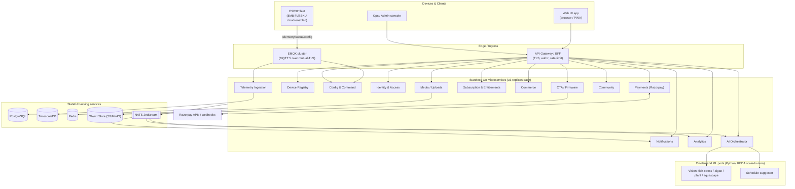
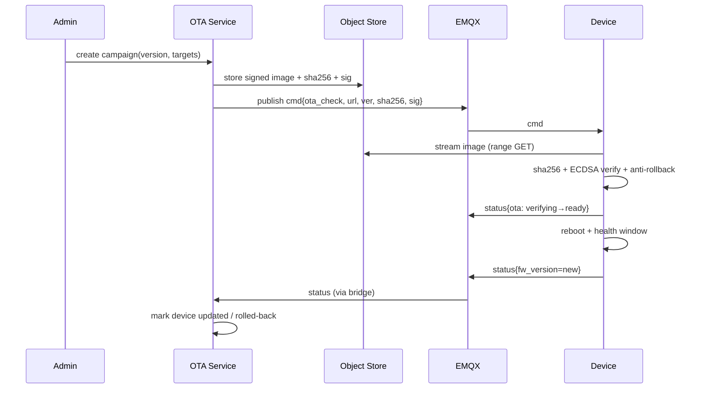
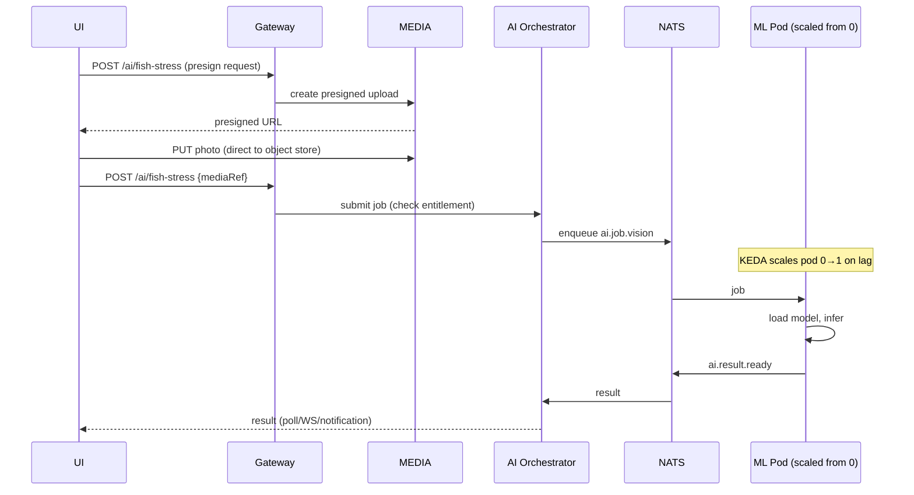
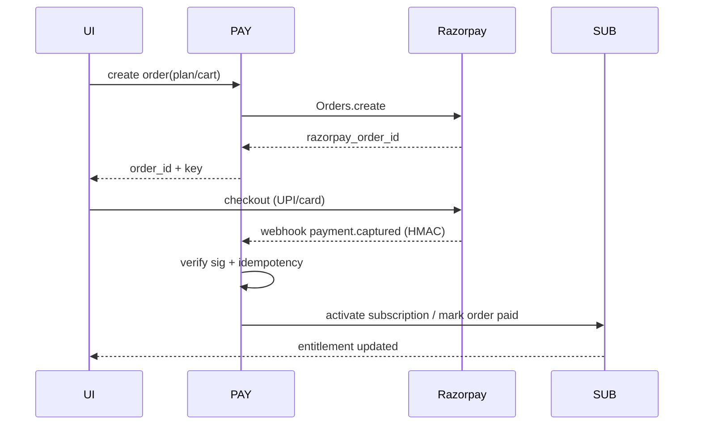

# f-tank Cloud Platform — Architecture (v1 draft)

> **Status:** Draft v1 — *architecture only, no implementation yet. Core decisions are **proposed**
> in §19 (ADRs) and **awaiting your review** — not yet approved. Reversible behind service interfaces.*
> **Scope:** the cloud backend in [`server/`](./README.md). Pairs with the firmware in
> [`embedded/`](../embedded/README.md) and the (planned) Web UI in [`ui/`](../ui/README.md).
> **Authority:** This document is **subordinate** to [`docs/REQUIREMENTS.md`](../docs/REQUIREMENTS.md).
> Where they conflict, REQUIREMENTS.md wins and this doc must be corrected. Requirement IDs
> (`FR-*`, `NFR-*`, `AD-*`) are cited throughout.

---

## 1. Purpose & Scope

The f-tank cloud platform is the **remote brain and commercial backend** for the fleet of ESP32
aquarium controllers. It must:

- **Manage the IoT fleet remotely** — registry, health, config, commands, OTA (FR-3, FR-38/39).
- **Track every device** — identity, firmware version, OTA status, subscription state.
- Serve **two distinct API audiences**: the **Web UI** (humans) and **IoT devices** (machines),
  plus an internal **admin/ops** surface.
- Power the **subscription business**: accounts, billing, entitlements, tiers
  (Basic / Premium / Subscription per REQUIREMENTS §1).
- Provide **Premium AI capabilities**: schedule suggestions, fish-stress monitoring, algae
  monitoring, plant-health monitoring, aquascaping ratings, and a fish community.
- Run **commerce**: merchandise, orders, payments (Razorpay), notifications, analytics, community.
- Be **cloud-native**: stateless services (≥3 replicas, horizontally scalable) that can launch
  on-demand **ML pods**.

**Non-goals (v1):** the cloud must *never* be required for local scheduling or local control
(FR-1/FR-4). The device is authoritative offline; the cloud is strictly **additive**.

---

## 2. Guiding Principles & Constraints

| # | Principle | Source |
|---|-----------|--------|
| P1 | Cloud is additive — losing it never breaks local scheduling/control. | FR-1, FR-3, FR-4 |
| P2 | All services are **stateless**; state lives in Postgres / TimescaleDB / Redis / object store. | user req |
| P3 | Every service horizontally scalable, min **3 replicas**, HPA-driven. | user req |
| P4 | The device↔cloud **contract is fixed** by the firmware; the cloud adapts to it, not vice-versa. | §7 below |
| P5 | All external input validated & bounded; defense-in-depth. | NFR-8 |
| P6 | TLS everywhere; device identity via **mutual TLS (X.509)**; never hardcode secrets. | NFR-5/6/7 |
| P7 | OTA images are **ECDSA-P256 signed, anti-rollback**; the cloud signs offline, never on a hot path. | FR-39, §7.3 |
| P8 | Tier/entitlement is enforced **server-side**, independent of hardware variant. | REQUIREMENTS §1 |
| P9 | Idempotency on all money/command paths; exactly-once *effects*, at-least-once delivery. | best practice |
| P10 | Observability is first-class (traces, metrics, logs) from day one. | best practice |

---

## 3. Technology Stack (locked decisions)

| Concern | Choice | Rationale |
|---------|--------|-----------|
| Core service language | **Go** | Stateless, high-throughput, small images, great for MQTT/HTTP fan-out. |
| ML services language | **Python (FastAPI + PyTorch/ONNX Runtime)** | Vision/ML ecosystem; isolated, on-demand pods. |
| Primary datastore | **PostgreSQL 16** | Relational integrity for accounts, orders, payments, subscriptions. |
| Time-series store | **TimescaleDB** (Postgres extension) | Open-source, scales via hypertables + native compression + continuous aggregates; one engine to operate. |
| Cache / sessions / rate-limit | **Redis** | Low-latency shared state without making services stateful. |
| IoT broker | **EMQX** | MQTT 5.0, clustering, k8s operator, rich authn/authz hooks, mTLS, rule-engine bridge to internal bus. |
| Internal event bus | **NATS JetStream** | Go-native, lightweight, durable streams; service-to-service events & ML job dispatch. |
| Object storage | **S3-compatible (MinIO self-host → cloud S3)** | Firmware artifacts, user photos, ML model registry, invoices. |
| Payments | **Razorpay** | India (`ap-south-1`); orders, subscriptions, webhooks, UPI/cards. |
| Container orchestration | **Kubernetes** | Stateless deployments, HPA, KEDA scale-to-zero for ML. |
| API gateway / ingress | **Envoy / NGINX Ingress + Go BFF** | TLS termination, routing, rate limiting, WAF hooks. |
| Observability | **OpenTelemetry → Prometheus + Grafana + Loki + Tempo** | Unified traces/metrics/logs. |
| Secrets | **External Secrets / Vault + sealed-secrets** | No secrets in images or git (NFR-5). |
| AuthN | **OIDC/JWT (access) + opaque refresh**, Argon2id passwords | Standard, stateless verification. |
| IaC / deploy | **Helm + Argo CD (GitOps)** | Reproducible, auditable rollouts. |

> **Time-series rationale (user asked "any open-source that scales"):** TimescaleDB is chosen over
> InfluxDB because Postgres is already the primary store — telemetry can be joined to device/account
> rows, operated with one backup/HA story, and scaled with hypertable partitioning + compression +
> continuous aggregates. If single-node write throughput is ever exceeded, the same SQL model moves
> to **Timescale multi-node** or a columnar OLAP sink (**ClickHouse**) fed from the event bus — that
> migration is isolated behind the Telemetry service interface.

---

## 4. System Context



---

## 5. Service Catalog

Each service is an independently deployable Go binary (Python for ML), stateless, ≥3 replicas,
owns its **own schema** in Postgres (schema-per-service; no cross-service table joins — integrate via
APIs or events). All inter-service async communication flows through **NATS JetStream**.

| Service | Owns | Sync API (who calls) | Emits / consumes events | Key reqs |
|---------|------|----------------------|-------------------------|----------|
| **Identity & Access (IDP)** | users, credentials, sessions, RBAC roles, API keys, device-pair tokens | UI, all services (token introspection) | `user.registered`, `user.deleted` | FR-36/37 |
| **Device Registry (REG)** | device record, hardware variant, channel count, **relay polarity & cut-target (provisioned)**, pairing, ownership, current FW version | UI, IDP, OTA, CFG | `device.registered`, `device.paired`, `device.online/offline` | FR-11/12/24, REQUIREMENTS §1 |
| **Config & Command (CFG)** | desired config (mirror of device config JSON), command queue | UI, MQTT bridge | publishes `config/set`,`cmd`; consumes `config/state` | FR-33/34/35, §7.1 |
| **Telemetry Ingestion (TEL)** | time-series temp/channel-state/alerts, last-seen | UI/Analytics (read) | consumes `telemetry`,`status`; emits `alert.raised` | FR-29/31, §7 |
| **OTA / Firmware (OTA)** | firmware artifacts metadata, signatures, **rollout campaigns**, per-device OTA status | UI/Admin, REG | `ota.assigned`, `ota.completed/failed` | FR-38/39, §7.3 |
| **Subscription & Entitlements (SUB)** | plans, tiers, entitlements, device→plan mapping, feature gates | all services (gate checks) | `subscription.activated/expired` | REQUIREMENTS §1 |
| **Notifications (NOTI)** | channels (push/email/SMS), templates, delivery log, user prefs | UI; event-driven | consumes `alert.raised`, `ota.*`, `order.*` | FR-23/26, FR-3 |
| **Commerce (COM)** | merchandise catalog, cart, orders, inventory, shipping | UI | `order.created`, `order.fulfilled` | user req |
| **Payments (PAY)** | Razorpay orders/subscriptions, transactions, invoices, webhooks | UI, COM, SUB | `payment.captured/failed`, `invoice.issued` | user req |
| **Community (CMTY)** | fish-community profiles, posts, comments, likes, moderation, aquascape gallery | UI | `post.created`, `post.flagged` | user req |
| **Analytics (ANA)** | aggregated metrics, dashboards, fleet KPIs, business KPIs | UI/Admin | consumes most events; reads TimescaleDB aggregates | user req |
| **AI Orchestrator (AIO)** | inference jobs, model registry refs, results cache, AI entitlement gating | UI, event-driven | dispatches ML jobs; `ai.result.ready` | Premium AI set |
| **Media / Uploads (MEDIA)** | presigned uploads, image storage refs, EXIF strip, virus/format scan | UI, AIO | `media.uploaded` | AI image intake |
| **ML pods (Python)** | the actual models (vision + schedule) | invoked by AIO only | — | Premium AI set |

> **API Gateway / BFF** is not a domain service — it is the edge: TLS termination, JWT verification
> (delegated to IDP), per-route rate limiting, request shaping, and the **error-page contract** (§14).

---

## 6. Device ↔ Cloud Contract (fixed by firmware — DO NOT drift)

The cloud must implement exactly what the firmware already speaks. Source of truth:
[`embedded/src/cloud/CloudTopics.h`](../embedded/src/cloud/CloudTopics.h),
[`embedded/src/cloud/CloudClient.h`](../embedded/src/cloud/CloudClient.h),
[`embedded/src/ota/OtaTypes.h`](../embedded/src/ota/OtaTypes.h), and REQUIREMENTS §7.

### 6.1 Transport & identity
- Device **dials out** to EMQX over **MQTT 5 + mutual TLS** with a provisioned **X.509 client cert**
  (no inbound port on the device). EMQX validates the client cert; the CN/SAN carries the
  `deviceId`. (NFR-6, CloudClient.h.)
- `deviceId` charset is strictly `[A-Za-z0-9_-]`, max **32** chars — the cloud MUST apply the same
  validation before using it anywhere (topic, SQL, log) to prevent injection
  ([`CloudTopics.h::isValidDeviceId`](../embedded/src/cloud/CloudTopics.h)).

### 6.2 Topic map (`ftank/<deviceId>/<suffix>`)

| Suffix | Dir | Retained | Cloud role |
|--------|-----|:--------:|-----------|
| `telemetry` | device → cloud | no | TEL ingests → TimescaleDB |
| `status` | device → cloud | **yes** | REG/TEL: online state, FW version, alert summary |
| `config/state` | device → cloud | **yes** | CFG: reconcile reported vs desired config |
| `config/set` | cloud → device | no | CFG: push desired config (validated, bounded) |
| `cmd` | cloud → device | no | CFG: commands (e.g. trigger OTA check, reboot, log on/off) |

EMQX **rule-engine / bridge** republishes inbound device messages onto **NATS JetStream**
(`ft.ingest.telemetry`, `ft.ingest.status`, `ft.ingest.configstate`) so core services consume from
one internal bus and EMQX stays a pure broker. Outbound (`config/set`, `cmd`) is published by CFG via
the EMQX client API.

### 6.3 Payload schemas (cloud-side validators)
The cloud re-validates everything (P5/NFR-8). Each payload is small JSON; the cloud bounds sizes,
rejects unknown fields, and clamps numeric ranges to match firmware limits (≤16 channels, ≤8 windows,
minutes-since-midnight 0–1439, thresholds sane). The canonical config JSON mirrors the **local API**
config object (REQUIREMENTS §7.1 `GET /api/v1/config`) so UI, device, and cloud share one shape.

### 6.4 OTA contract (§7.3)
- Cloud stores firmware artifacts + computes/holds: version (semver/monotonic), **SHA-256**, and an
  **ECDSA-P256 signature** produced **offline** by the release pipeline
  ([`embedded/scripts/sign_firmware.sh`](../embedded/scripts/sign_firmware.sh)). The private key never
  enters the cluster.
- A rollout is a **campaign** (target set + version). The cloud sends a `cmd` to check-in; the device
  fetches/streams the signed image and verifies SHA-256 + signature + **anti-rollback (strictly newer)**
  on-device. The cloud only **tracks status**; it never bypasses on-device verification (P7).
- OTA status state machine mirrors firmware `OtaState`/`OtaError`
  ([`OtaTypes.h`](../embedded/src/ota/OtaTypes.h)): `idle→assigned→downloading→verifying→ready→applied`
  or `failed(reason)`.



---

## 7. API Architecture

Three logical surfaces behind the gateway; all versioned (`/api/v1`), all return the structured error
envelope (§14).

### 7.1 UI API (BFF, human-facing)
JWT bearer (short-lived access + refresh). Aggregates across services for the UI. Examples:
`/api/v1/auth/*`, `/api/v1/devices`, `/api/v1/devices/{id}/config`, `/api/v1/devices/{id}/telemetry`,
`/api/v1/subscriptions`, `/api/v1/shop/*`, `/api/v1/orders`, `/api/v1/community/*`, `/api/v1/ai/*`,
`/api/v1/notifications/*`.

### 7.2 IoT/Device API
Primary device channel is **MQTT** (§6). A thin HTTPS surface exists for **OTA artifact download**
(range GET to object store via signed URL) and **device check-in/registration** during provisioning.
Auth = mutual-TLS cert (MQTT) and signed URLs (artifact fetch). The **LAN** device API
(REQUIREMENTS §7.1) stays on the device itself — the cloud mirrors its config shape but does not
replace it.

### 7.3 Admin/Ops API
RBAC-gated (`role=ops/admin`): fleet view, OTA campaigns, catalog management, refunds, moderation,
analytics. Same gateway, stricter authz + audit log on every mutation.

### 7.4 Contract management
OpenAPI 3.1 spec per service (committed under `server/<svc>/api/openapi.yaml`); Go types generated
from it; the UI generates its client from the same spec → **one contract, three concerns** (matches
the monorepo principle in [`.github/copilot-instructions.md`](../.github/copilot-instructions.md)).

---

## 8. Data Architecture

### 8.1 Relational (PostgreSQL, schema-per-service)
Representative core tables (not exhaustive; FKs only within a schema):

- **idp**: `users`, `credentials`, `sessions`, `roles`, `user_roles`, `api_keys`,
  `device_pair_tokens`.
- **registry**: `devices`(id, owner_user_id, hw_variant, channel_count, fw_version, last_seen,
  online), `device_channels`(device_id, idx, polarity, cut_target, provisioned_name), `pairings`.
- **config**: `desired_config`(device_id, version, json, updated_by), `reported_config`,
  `command_queue`.
- **ota**: `firmware`(version, sha256, sig, artifact_key, min_from), `campaigns`,
  `device_ota_status`.
- **subscription**: `plans`, `entitlements`, `subscriptions`(user_id/device_id, plan, status, period).
- **commerce**: `products`, `variants`, `inventory`, `carts`, `orders`, `order_items`, `shipments`.
- **payments**: `razorpay_orders`, `transactions`, `invoices`, `webhook_events`(idempotency).
- **community**: `profiles`, `posts`, `comments`, `reactions`, `reports`, `aquascape_entries`.
- **notifications**: `channels`, `templates`, `preferences`, `deliveries`.
- **ai**: `inference_jobs`, `results`, `model_versions`.

Polarity / cut-target live **here, provisioned at registration** and pushed to the device — they are
**immutable at runtime** and **not part of schedule CRUD** (FR-12/24, P4).

### 8.2 Time-series (TimescaleDB)
- Hypertables: `telemetry_temp`(time, device_id, celsius, valid), `telemetry_channel`(time,
  device_id, channel, state), `device_events`(time, device_id, type, severity, payload).
- **Compression** after N days; **continuous aggregates** for hourly/daily rollups feeding Analytics;
  **retention policies** per tier (Subscription keeps full history — FR-31).

### 8.3 Object storage
Firmware images + sigs, user-uploaded photos (fish/algae/plant/aquascape), ML model artifacts,
generated invoices/PDF. Access via short-lived **presigned URLs** only; images are EXIF-stripped and
format/scan-checked on intake (MEDIA service).

### 8.4 Caching & ephemeral
Redis: session/JWT denylist, rate-limit counters, idempotency keys, hot device-online presence,
AI-result cache, catalog cache.

---

## 9. Authentication & Authorization

- **Users:** email/password (Argon2id) → OIDC-style **JWT access (≤15 min)** + **opaque refresh**
  (rotating, stored hashed). Optional social/OAuth later. (FR-36.)
- **Service-to-service:** mTLS inside the mesh + short-lived service JWTs; no service trusts another
  by network position alone (zero-trust).
- **Devices:** **mutual-TLS X.509** to EMQX (identity = cert); EMQX ACL restricts each device to its
  own `ftank/<deviceId>/#` subtree (a device can never read/write another device's topics). Artifact
  fetch via signed URL. (NFR-6, §6.1.)
- **LAN pairing:** the per-device **bearer token** issued during BLE provisioning (REQUIREMENTS §7.2)
  is *device-local*; the cloud holds only its hash for pairing verification, so LAN control keeps
  working with cloud down (FR-37, P1).
- **RBAC:** roles `user`, `ops`, `admin`, `support`; entitlement checks (SUB) gate Premium/AI/cloud
  features server-side (P8). Every mutating admin action is **audit-logged**.

---

## 10. Subscription & Entitlements (tiers)

Maps REQUIREMENTS §1 tiers to enforceable server-side gates:

| Capability | Basic | Premium | Subscription |
|-----------|:-----:|:-------:|:------------:|
| Local control / scheduling (on device) | ✅ | ✅ | ✅ |
| On-demand logs | ✅ | ✅ | ✅ |
| SD-card persistent logs (device) | — | ✅ | ✅ |
| Cloud log storage + history/analytics | — | — | ✅ |
| Remote access (config/command via cloud) | — | — | ✅ |
| **Premium AI suite** (schedule/vision) | — | gated add-on | ✅ |
| Community read | ✅ | ✅ | ✅ |
| Community post / aquascape ratings | gated | ✅ | ✅ |

The SUB service is the single source of entitlement truth; the gateway and each service consult it
(cached in Redis) before serving a gated feature. Subscription lifecycle is driven by PAY events
(`payment.captured` → activate; expiry/cancel → downgrade). AI features additionally require an
active entitlement at job-submit time.

### 10.1 Local-only / no-subscription operating mode

A customer MAY run a device **entirely offline with no cloud account** and lose nothing on the local
control path. This is a first-class mode, not a degraded fallback — it follows directly from P1 /
FR-1 / FR-4 (the cloud is additive and must never gate local control).

**Works with zero server dependency (Basic, + Premium with SD):**

- Scheduling & relay control run on-device from the DS3231 RTC, fully offline (FR-1).
- The Web UI talks **directly to the ESP32** over LAN via its own `/api/v1/*` REST + WebSocket API
  (REQUIREMENTS §7.1), authed by the per-device **bearer token** issued at BLE provisioning — no
  cloud account required (FR-37).
- Temperature alerts + heater-cut safety act locally (buzzer + app notification) (FR-23/26).
- On-demand logs stream locally; SD-card persistence on the 8 MB Premium SKU (FR-29/30).
- Signed OTA can be applied over the **LAN** API (`POST /api/v1/ota`) with no cloud (§7.3).

**Requires the cloud (Subscription tier) — unavailable in local-only mode:**

- Remote access from outside the home LAN; cloud log history & long-term analytics; push
  notifications when away from the LAN; the **Premium AI suite** (runs in server ML pods); community
  and commerce tie-ins.

**Operating-cost implication:** a local-only device imposes **~₹0/month** of cloud cost on the
operator. The only optionally-shared cost is **firmware distribution** — hosting signed OTA images
for download (a few rupees of S3/CDN) if updates aren't side-loaded via the app. This yields a clean
business split: **hardware sale = perpetual local capability; subscription = cloud + AI + remote.**

---

## 11. AI / ML Platform

**AI Orchestrator (Go)** owns job lifecycle, entitlement gating, result caching, and dispatch. The
**models run in separate Python pods** that **scale to zero** when idle and scale up on queue depth
via **KEDA** (triggered by NATS stream lag). Optional **GPU node pool** for vision; CPU+ONNX for
lighter models.

| Capability | Input | Model type | Output |
|-----------|-------|-----------|--------|
| **Schedule suggestions** | device config + telemetry history + species hints | tabular / heuristic + LLM-assist | proposed channel windows (user-approved before apply) |
| **Fish stress monitoring** | photo (via UI → MEDIA) | vision classifier / pose | stress score + indicators |
| **Algae monitoring** | tank photo | vision segmentation | algae type/coverage + advice |
| **Plant health** | plant photo | vision classifier | deficiency/health flags |
| **Aquascaping ratings** | aquascape photo | vision scorer | composition/aesthetic score + tips |
| **Fish community** | profiles + posts | CMTY service (+ optional recommender) | feed, matching, tagging |



Safety: AI outputs are **advisory**. AI-suggested schedules are **never auto-applied** — they go
through the same validated config path and require user confirmation (consistent with FR-13/FR-34 and
the "advisory, not autonomous" safety posture).

---

## 12. Commerce, Payments, Notifications, Community, Analytics

- **Commerce (COM):** catalog, inventory, cart, orders, fulfilment/shipping states. Emits
  `order.created` → PAY; `order.paid` → fulfilment.
- **Payments (PAY) — Razorpay:** create Razorpay **Order** server-side; client completes checkout;
  **webhook** confirms `payment.captured` (verified via **HMAC signature**). Subscriptions use
  Razorpay Subscriptions/recurring. **Idempotency** keyed on Razorpay event id (`webhook_events`
  table) → exactly-once effect (P9). Refunds via Admin API with audit. **Never trust client-side
  payment status** — only the verified webhook.



- **Notifications (NOTI):** fan-out from events — device **alerts** (extreme temp / sensor fault →
  push, FR-23/26), OTA results, order/payment updates, community mentions. Channels: push (FCM/APNs),
  email, SMS; per-user preferences; delivery log + retry with backoff.
- **Community (CMTY):** fish-community profiles, posts/comments/reactions, aquascape gallery feeding
  the ratings feature, moderation + reporting pipeline.
- **Analytics (ANA):** business KPIs (MRR, conversion, orders) + fleet KPIs (online rate, OTA success,
  alert rates, temp distributions) from TimescaleDB continuous aggregates and the event bus. Serves
  Admin dashboards; respects tenant isolation.

---

## 13. Eventing (NATS JetStream) — internal backbone

Durable streams; consumers are idempotent. Indicative subjects:

| Subject | Producer | Consumers |
|---------|----------|-----------|
| `ft.ingest.telemetry` / `ft.ingest.status` / `ft.ingest.configstate` | EMQX bridge | TEL, REG, CFG |
| `ft.device.online` / `ft.device.offline` | REG | NOTI, ANA |
| `ft.alert.raised` | TEL | NOTI, ANA |
| `ft.ota.assigned/completed/failed` | OTA | NOTI, ANA |
| `ft.order.created/paid/fulfilled` | COM/PAY | NOTI, ANA, SUB |
| `ft.payment.captured/failed` | PAY | SUB, COM, NOTI |
| `ft.subscription.activated/expired` | SUB | REG, NOTI, AIO |
| `ft.ai.job.*` / `ft.ai.result.ready` | AIO | ML pods, AIO |
| `ft.media.uploaded` | MEDIA | AIO |

---

## 14. Error Model & Error Pages

- **API error envelope** (every service, every surface):
  ```json
  { "error": { "code": "ENTITLEMENT_REQUIRED", "message": "...", "traceId": "...", "details": {} } }
  ```
  HTTP mapping aligns with the device LAN API (REQUIREMENTS §7.1): `400` invalid input, `401`
  unauthenticated, `403` not entitled/forbidden, `404`, `409` conflict/idempotency, `429` rate-limit,
  `503` transient. `traceId` ties to the OTel trace for support.
- **Human error pages** (served by the gateway/UI edge): branded `400/401/403/404/429/500/503`
  pages and a maintenance page; never leak stack traces or internal identifiers (NFR-8 spirit).
- **Device-facing**: machine errors only (MQTT/HTTP codes); no HTML.

---

## 15. Cross-Cutting Concerns

- **Security (NFR-5/6/7/8):** TLS/mTLS everywhere; secrets via Vault/External-Secrets (none in git);
  strict input validation & size bounds on every boundary (mirrors firmware's
  [`ApiValidation.h`](../embedded/src/api/ApiValidation.h) discipline); per-device topic ACLs;
  signed URLs; OWASP Top-10 review gates; rate limiting & WAF at the edge; audit logs on privileged
  actions; PII minimization; payment data handled per Razorpay/PCI guidance (no raw card storage).
- **Idempotency (P9):** idempotency keys on writes that cause side effects (orders, payments,
  command dispatch, OTA assignment); dedupe via Redis + persisted event ids.
- **Observability (P10):** OpenTelemetry traces across gateway→service→bus→ML; RED/USE metrics;
  structured JSON logs to Loki; SLOs + alerting (Alertmanager).
- **Multi-tenancy & isolation:** every query scoped by `owner_user_id`/`device_id`; row-level
  security where appropriate; no cross-tenant data bleed.
- **Resilience:** circuit breakers, timeouts, retries with jittered backoff; graceful degradation —
  if AI/cloud/analytics are down, device control and core APIs keep working (P1).

---

## 16. Deployment Topology (Kubernetes)

- **Stateless services:** `Deployment`, `replicas: 3` min, **HPA** on CPU/RPS/queue-depth;
  `PodDisruptionBudget`; rolling updates; readiness/liveness probes; no node/local state.
- **ML pods:** `Deployment` with **KEDA ScaledObject** (NATS lag trigger), `minReplicas: 0`,
  optional GPU node pool + taints/tolerations.
- **Stateful backing:** Postgres/TimescaleDB (operator or managed), Redis, EMQX cluster, NATS,
  MinIO/S3 — run via operators or managed services, **outside** the stateless tier.
- **Namespaces:** `ftank-edge`, `ftank-core`, `ftank-ml`, `ftank-data`, `ftank-observability`.
- **GitOps:** Helm charts per service rendered by Argo CD; environments `dev`/`staging`/`prod` in
  `ap-south-1` (Razorpay/data-residency alignment).
- **Scaling story:** every service is horizontally scalable and stateless (P2/P3); the only vertical
  pressure points are the data tier (addressed by Timescale compression/aggregates + read replicas).

---

## 17. Proposed `server/` Repository Layout (for implementation phase)

```
server/
  ARCHITECTURE.md            # this doc
  README.md
  go.work                    # Go workspace tying the service modules
  api/                       # shared OpenAPI specs + generated types (the contract)
  pkg/                       # shared Go libs: authz, otel, validation, errors, eventbus, db
  services/
    gateway/                 # BFF / edge
    identity/
    registry/
    config/
    telemetry/
    ota/
    subscription/
    notifications/
    commerce/
    payments/
    community/
    analytics/
    ai-orchestrator/
    media/
  ml/                        # Python ML services (vision/, schedule/)
  deploy/
    helm/                    # one chart per service
    argocd/                  # app-of-apps
    emqx/                    # broker config, ACLs, bridge rules
  migrations/                # per-schema SQL migrations
  docs/                      # ADRs (adr-0001-go.md, adr-0002-timescaledb.md, ...)
```

> Mirrors the firmware's module-per-responsibility convention and keeps **one shared contract**
> (`api/`) across firmware ↔ server ↔ ui.

---

## 18. Build Order / Roadmap (proposed milestones)

| Milestone | Delivers | Depends on |
|-----------|----------|-----------|
| **S0 — Foundation** | repo scaffold, shared `pkg/`, OpenAPI contract, k8s/Helm baseline, Postgres+Timescale+Redis+NATS+EMQX dev stack, observability | — |
| **S1 — Identity + Registry** | accounts/registration/auth, device registry, pairing, mTLS enrollment | S0 |
| **S2 — Telemetry + Config/Command** | EMQX↔NATS bridge, ingestion to TimescaleDB, desired/reported config reconcile | S1 |
| **S3 — OTA** | firmware artifacts, signed-image campaigns, status tracking | S1, S2 |
| **S4 — Subscription + Payments (Razorpay)** | plans/entitlements, checkout, webhooks, gating | S1 |
| **S5 — Notifications + Analytics** | alert fan-out, dashboards, KPIs | S2, S4 |
| **S6 — Commerce** | catalog, cart, orders, fulfilment | S4 |
| **S7 — AI platform** | orchestrator + first vision model (fish-stress) + schedule suggester, KEDA | S2, S4, MEDIA |
| **S8 — Community** | profiles, posts, aquascape gallery + ratings | S1, S7 |

---

## 19. Architecture Decision Records (resolved)

> These were the open questions in earlier drafts. **Status: Proposed — awaiting owner review (not
> yet approved).** Each is reversible behind a service interface; three sub-items remain genuinely
> open (noted at the end of this section) but do not block milestones S0–S1.

### ADR-001 — Hosting model: hybrid (managed data tier, self-hosted broker first)
**Decision:** Managed **PostgreSQL/TimescaleDB** and **object store (S3)**; **self-host EMQX** on
Kubernetes initially; everything in **`ap-south-1`**.
**Why:** Backups/HA/PITR for the data tier aren't worth self-operating early; EMQX self-host matches
the REQUIREMENTS §6 rollout (self-hosted broker → managed for beta) and the firmware only needs a
re-provisioned endpoint + certs to move later (no code change).
**Reversible:** broker can move to managed (e.g. AWS IoT Core) without firmware changes.

### ADR-002 — Cloud command path: MQTT (not WebSocket)
**Decision:** The cloud command/telemetry path stays on **MQTT 5 + mutual-TLS**.
**Why:** The firmware [`CloudClient`](../embedded/src/cloud/CloudClient.h) already dials out over MQTT
with an X.509 client cert. Switching to WebSocket would force a firmware rework for no gain. Settles
the REQUIREMENTS §6 open item in favor of MQTT.

### ADR-003 — Device certificate lifecycle: private CA + per-device certs
**Decision:** A dedicated **private PKI** (offline root → online intermediate). A per-device cert is
issued **at provisioning/registration**, CN/SAN = `deviceId`. Rotation before expiry; revocation via
**EMQX ACL + CRL/OCSP**.
**Why:** Mirrors the OTA "private key stays offline" posture (§6.4); gives per-device identity and
revocation without a managed PKI dependency. Re-issue/rotation is a registration-flow concern (S1).
**Reversible:** can adopt a managed IoT cert service later behind the enrollment interface.

### ADR-004 — Notifications: FCM + APNs push, pluggable email/SMS
**Decision:** **FCM + APNs** for app push (device alerts FR-23/26, OTA, orders); **email/SMS behind a
provider interface**, starting with one transactional vendor each.
**Why:** Native push for latency-sensitive alerts; the interface lets us swap email/SMS vendors
without code churn. Settles the REQUIREMENTS §6 notification-provider open item.

### ADR-005 — AI model sourcing: pretrained/3rd-party first, fine-tune later
**Decision:** Ship the first vision + schedule features on **pretrained / 3rd-party models** inside
the Python pods; **collect labeled data** via the community/gallery; **fine-tune in-house** once
volume exists.
**Why:** Fastest path to value; the AI Orchestrator interface (§11) is identical regardless of model
origin, so swapping to self-trained models later is isolated.

### ADR-006 — Internal event bus: NATS JetStream
**Decision:** **NATS JetStream** for all internal async events (§13).
**Why:** Go-native, lightweight, durable streams; sufficient for fleet + business eventing.
**Reversible:** move to Kafka only if analytics throughput later demands it (bus is behind an
`eventbus` package in `pkg/`).

### ADR-007 — Data residency & compliance: India DPDP-aligned
**Decision:** All PII + payment metadata stored **in `ap-south-1`**; **PII minimized**; **no raw card
data** (Razorpay handles card/PCI scope); retention per tier (Subscription = full history, FR-31).
**Why:** Aligns with Razorpay region and India DPDP; keeps the cluster out of PCI cardholder scope.

> **Still genuinely open (need product/legal input, not blocking S0–S1):** final transactional
> email/SMS vendor selection (ADR-004), GPU vs CPU-only for the first vision models (ADR-005), and
> formal DPDP retention/consent copy (ADR-007).

---

## 20. Requirement Traceability (summary)

| Area | Requirements satisfied |
|------|------------------------|
| Cloud is additive, never blocks local | FR-1, FR-3, FR-4, P1 |
| Accounts, multi-device, LAN pairing | FR-36, FR-37 |
| Config CRUD mirror, persistence | FR-33, FR-34, FR-35 |
| Provisioned polarity / cut-target (immutable) | FR-11, FR-12, FR-24 |
| Telemetry + cloud logs/analytics (Subscription) | FR-29, FR-31, REQUIREMENTS §1 |
| Alerts → notifications | FR-23, FR-26 |
| Signed OTA + rollback + anti-rollback | FR-38, FR-39, §7.3 |
| Security (TLS/mTLS, secrets, validation) | NFR-5, NFR-6, NFR-7, NFR-8 |
| Tiers / entitlements server-side | REQUIREMENTS §1, §7 |

---

*Implementation has not started. This document defines the target architecture only. The core
decisions are **proposed** as ADRs in §19 and **await your approval**; the next step is milestone
**S0 — Foundation** once you sign off.*
